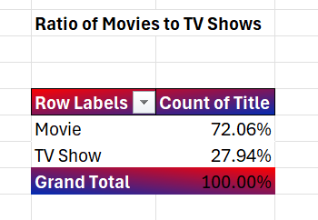
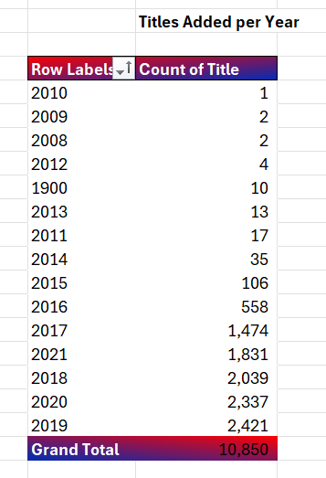
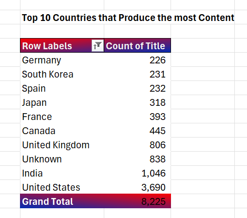
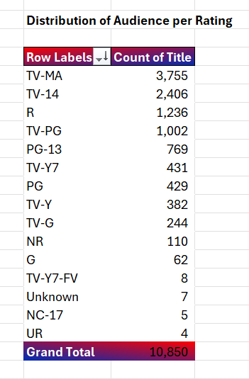
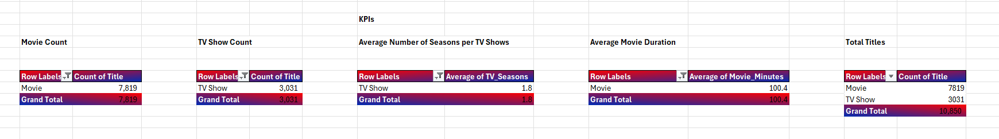
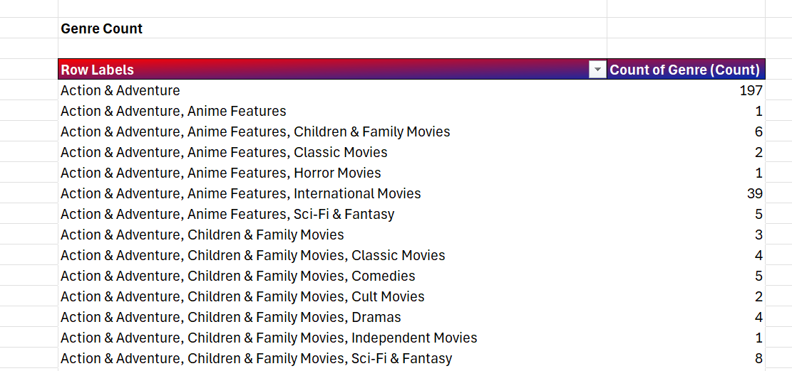
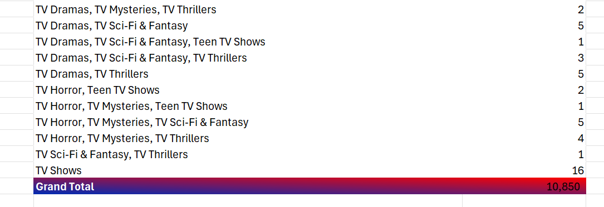
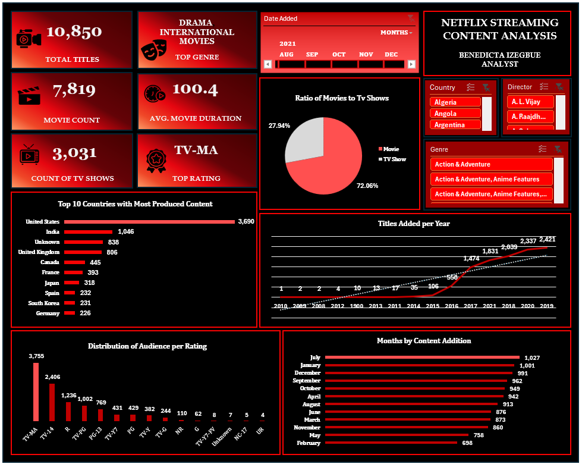

# 📊 Netflix Streaming Content Analysis (Excel Project)

An end-to-end Excel analytics project that cleans, structures, and analyzes a raw catalog of **8,807 Netflix titles** to uncover patterns in content type, growth, geography, ratings, and genre — culminating in an interactive one-page dashboard.

---

## 🎯 Project Overview

Netflix's content library spans thousands of movies and TV shows sourced from dozens of countries, with inconsistent formatting typical of real-world entertainment industry data (missing credits, mixed date formats, multi-value fields). This project simulates a content/business analyst task: take a messy raw export, clean it into an analysis-ready table, and surface insights a streaming platform's content strategy team could act on.

**Workbook structure:**

| Sheet | Purpose |
|---|---|
| `Sheet1` | Original, unmodified raw dataset (8,807 rows × 12 columns) |
| `Table1` | Cleaned dataset with formulas, calculated fields, and an Excel Table (10,850 rows × 17 columns) |
| `Sheet3` | PivotTables powering the analysis (Content Strategy, Growth, Geography, Ratings, KPIs, Genres) |
| `Dashboard` | Consolidated, chart-based dashboard summarizing key findings |

---

## 🧹 Data Cleaning (`Sheet1` → `Table1`)

The raw export had the missing-data and formatting issues typical of scraped/exported catalog data:

| Field | Issue in Raw Data | Cleaning Action |
|---|---|---|
| `Director` | 2,634 blanks | Replaced blanks with `"Unknown"` for reliable grouping in pivots |
| `Cast` | 825 blanks | Replaced blanks with `"Unknown"` |
| `Country` | 831 blanks | Replaced blanks with `"Unknown"`; multi-country titles (e.g., *Sankofa*, listed as "United States, Ghana, Burkina Faso, United Kingdom, Germany, Ethiopia") were split into **one row per country** so geographic pivots count each production market accurately — this is why `Table1` (10,850 rows) has more rows than `Sheet1` (8,807 rows) |
| `Date_Added` | 10 blanks; stored as full datetime | Parsed into separate `Year_Added` and `Month_Added` fields for time-based analysis |
| `Duration` | Mixed units — `"90 min"` for movies, `"2 Seasons"` for TV shows in one text column | Split into two clean numeric fields: `Movie_Minutes` and `TV_Seasons` |
| `Listed_In` (genres) | Comma-separated multi-genre string (e.g., "Crime TV Shows, International TV Shows, TV Dramas") | Added a `Genre (Count)` field counting how many genres are tagged per title, enabling genre-density analysis |
| `Rating` | A small number of rows had duration values ("66 min", "84 min", "74 min") sitting in the rating column — a column-shift artifact from the source file | Replaced rows containing inconsistent values with "Unknown" |

All cleaning was done on a structured **Excel Table** (`Table1_1`) so formulas use readable structured references instead of cell ranges, and the table auto-expands with new data.

### Formulas & Functions Used

| Formula | Applied To | What It Does |
|---|---|---|
| `=TEXT(Table1_1[[#This Row],[Date_Added]],"yyyy")` | `Year_Added` | Extracts the year a title was added to Netflix |
| `=TEXT(Table1_1[[#This Row],[Date_Added]],"mmmm")` | `Month_Added` | Extracts the full month name |
| `=IF(B2="Movie",VALUE(SUBSTITUTE(L2,"min","")),"")` | `Movie_Minutes` | Strips "min" from the duration text and converts it to a usable number, only for movies |
| `=IF(B2="TV Show",VALUE(SUBSTITUTE(SUBSTITUTE(L2,"Seasons",""),"Season","")),"")` | `TV_Seasons` | Strips "Season(s)" and converts to a number, only for TV shows |
| `=LEN(...)-LEN(SUBSTITUTE(...,",",""))+1` | `Genre (Count)` | Counts genres per title by counting commas in the `Listed_In` field |

---

## 📈 PivotTable Analysis (`Sheet3`)

Six PivotTable blocks were built directly from `Table1`, each answering a distinct business question:

1. **Content Strategy** — Ratio of Movies to TV Shows
---

2. **Content Acquisition & Growth** — Titles added per year; content additions by month
---

3. **Geographic Insights** — Top 10 content-producing countries
---

4. **Rating & Audience** — Distribution of titles by content rating
---

5. **KPIs** — Movie count, TV show count, average seasons per TV show, average movie duration
---

6. **Genre Count** — Frequency of each genre/genre-combination and total titles by type
---

---

## 📊 Dashboard Visualization

The `Dashboard` sheet consolidates the pivot analysis into five charts plus KPI summary callouts:

---

## Dashboard

---

---

| Chart | Type | Insight |
|---|---|---|
| Ratio of Movies to TV Shows | Pie chart | Content-type split |
| Titles Added per Year | Line chart | Catalog growth trend, 2008–2021 |
| Months by Content Addition | Bar chart | Seasonality of content releases |
| Top 10 Countries with Most Produced Content | Bar chart | Where Netflix sources content from |
| Distribution of Audience per Rating | Bar chart | Maturity-rating mix of the catalog |

---

## ❓ Analytical Questions & Answers

**1. What's the split between Movies and TV Shows?**
Movies make up **72%** of the catalog (7,819 titles) versus **28%** TV Shows (3,031 titles) — roughly a 2.6:1 ratio. Netflix's library has historically leaned toward film content.

**2. Which year saw the most titles added?**
**2019** was the peak year with **2,421 titles added**, capping a steady climb from just 2 titles in 2008. Additions slowed slightly in 2020 (2,337) and the partial 2021 data (1,831, reflecting the dataset's cutoff mid-year).

**3. Which countries produce the most content?**
The **United States** dominates with **3,211 titles**, followed by **India (1,008)** and the **United Kingdom (628)**. Canada, Japan, South Korea, France, and Spain round out the top producers, showing Netflix's international expansion beyond its US base.

**4. Is there seasonality in when content is added?**
Yes — **July** sees the most additions (1,027 titles), while **February** sees the fewest (698), suggesting a lighter release cadence in Q1.

**5. What's the most common content rating?**
**TV-MA** (mature audiences) is the single largest rating group at **3,755 titles (~35%)**, followed by **TV-14 (2,406)** and **R (1,236)**. Combined, mature-skewing ratings (TV-MA, TV-14, R) account for roughly two-thirds of the catalog.

**6. How long do TV shows typically run?**
The average is just **1.8 seasons per TV show**, indicating most series are short-run or get cancelled early rather than becoming long-running franchises.

**7. What's the average movie length?**
**~100.4 minutes** — in line with a standard theatrical/feature-length runtime.

**8. What genres dominate?**
Standalone genre tags with the highest counts include **Documentaries (424)**, **Stand-Up Comedy (335)**, and **Kids' TV (304)**. Among multi-genre combinations, **"Dramas, International Movies" (487 titles)** and **"Dramas, International Movies, Thrillers" / "Comedies, Dramas, International Movies" (both 300+)** stand out — reinforcing Netflix's heavy investment in international drama content.

---

## 💡 Recommendations

- **Grow the family/general-audience segment.** With roughly two-thirds of the catalog skewing mature (TV-MA/TV-14/R), there's room to expand PG/TV-PG/family content to attract a broader household audience.
- **Invest in renewing high-performing series.** An average of only 1.8 seasons per show suggests many series are cancelled early; identifying and renewing top-performing titles could improve retention and reduce subscriber churn.
- **Diversify sourcing beyond the top 3 markets.** The US, India, and UK account for the bulk of content; deeper investment in fast-growing markets like South Korea and Japan (both already strong performers per title count) could capture more international subscriber growth.
- **Align major releases with proven high-traffic months.** Historical addition patterns show July as the strongest month and February the weakest — release scheduling could be adjusted to smooth out or capitalize on this seasonality.
- **Standardize data capture at the source.** Recurring issues like duplicate country-name variants and shifted rating/duration values point to a need for stricter data validation in the content-ingestion pipeline, to keep future reporting accurate.

---

## 🔗 Connection to Professional Experience

This project directly builds on skills developed as a **Research Assistant at Universal Achievement Production Limited**, a Nigerian film and documentary production company:

- **Casting database & talent sourcing work** → translated into comfort navigating and querying large, structured datasets (applied here to 10,000+ Netflix records).
- **Maintaining accurate audition records for 300+ applicants** → built the data-accuracy discipline used to detect and systematically resolve missing values across the `Director`, `Cast`, `Country`, and `Date_Added` fields.
- **Recording meeting minutes and production documentation in Microsoft Office Suite** → gave a strong Office foundation that this project extends into advanced Excel formulas, PivotTables, and dashboard design.
- **Coordinating logistics and administrative records for documentary teams across multiple Nigerian states** → mirrors the geographic analysis performed here, synthesizing content data across dozens of countries into a single coherent view.
- **Managing high-volume front-desk operations (10+ visitors daily)** → reflects the process discipline and attention to detail applied throughout the data-cleaning stage of this project.

---

## 🛠️ Tools Used

- Microsoft Excel (Tables, PivotTables, PivotCharts)
- Formulas: `TEXT`, `IF`, `SUBSTITUTE`, `VALUE`, `LEN`, structured table references
- Dashboard design with linked PivotCharts and KPI summary cards

---

## 📁 Files

- `Netflix_Data.xlsx` — full workbook (raw data, cleaned table, pivots, dashboard)

---

✍️ Author's Note

This project represents my transition from administrative and research-based work into data analytics. As a former Research Assistant in the film and media industry, I developed strong skills in data organization, documentation, attention to detail, and information management. This Excel project allowed me to apply those strengths to a real-world dataset while building expertise in data cleaning, analysis, visualization, and dashboard development.

Working with over 10,000 cleaned records challenged me to think beyond formulas and charts by focusing on how data can support business decisions and tell meaningful stories. This project reflects my growing interest in transforming raw data into actionable insights and marks an important step in my journey toward becoming a professional Data Analyst.

— Benedicta Izegbue

Aspiring Data Analyst | Excel | SQL | Power BI

---

- LinkedIn Profile https://www.linkedin.com/in/benedicta-izegbue-b42198385/
- X Profile https://x.com/dicta_andy?s=21

